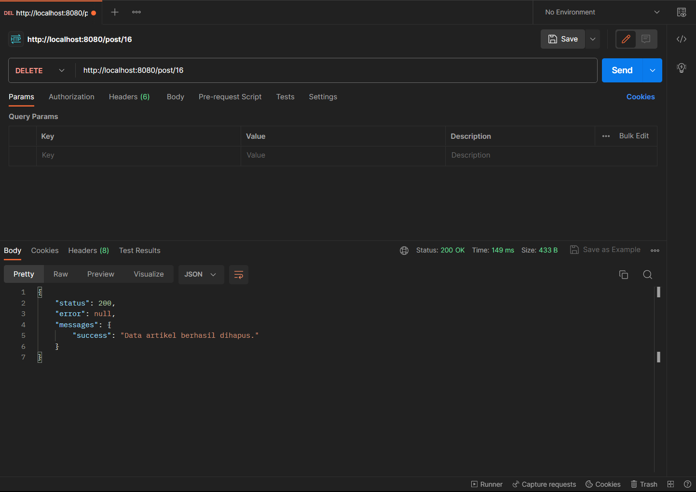

# Tugas Pemograman Web 2

**_<p>Nama: Delfian Ruly Havatilla</p>_**
**_<p>Kelas: TI.21.A.1</p>_**
**_<p>Nim: 312110161</p>_**

<br>

## Apa itu REST API?
<p align="center">
  
</p>

<p>REST API (Representational State Transfer Application Programming Interface) adalah sebuah arsitektur komunikasi yang digunakan dalam pengembangan aplikasi web. REST API memungkinkan aplikasi untuk berkomunikasi dengan aplikasi lain melalui protokol HTTP.</p>
<p>REST API menggunakan prinsip-prinsip dasar dari arsitektur web, seperti penggunaan metode HTTP (seperti GET, POST, PUT, DELETE) untuk mengakses dan memanipulasi sumber daya (resource) yang teridentifikasi dengan URL (Uniform Resource Locator). Setiap sumber daya dalam REST API memiliki URL unik yang digunakan untuk mengaksesnya.</p>
<p>Dalam REST API, data dikirim dan diterima dalam format yang umumnya adalah JSON (JavaScript Object Notation) atau XML (eXtensible Markup Language). JSON merupakan format yang lebih umum digunakan karena lebih ringan dan mudah dibaca oleh manusia maupun mesin.</p>

## Langkah-langkah Praktikum dan Persiapan
Periapan awal adalah mengunduh aplikasi REST Client, ada banyak aplikasi yang dapat digunakan untuk keperluan tersebut. Salah satunya adalah Postman. [Postman](https://www.postman.com/) merupakan aplikasi yang berfungsi sebagai REST Client, digunakan untuk testing REST API. Unduh apliasi Postman [Disini.](https://www.postman.com/downloads/)

## Membuat Model
Pada modul sebelumnya sudah dibuat ArtikelModel, pada modul ini kita akan memanfaatkan model
tersebut agar dapat diakses melalui API.

## Membuat REST Controller
Pada tahap ini, kita akan membuat file REST Controller yang berisi fungsi untuk menampilkan,
menambah, mengubah dan menghapus data. Masuklah ke direktori app\Controllers dan buatlah file
baru bernama Post.php. Kemudian, salin kode di bawah ini ke dalam file tersebut:

```php
<?php

namespace App\Controllers;

use CodeIgniter\RESTful\ResourceController;
use CodeIgniter\API\ResponseTrait;
use App\Models\ArtikelModel;

class Post extends ResourceController
{
  use ResponseTrait;
  // all users
  public function index()
  {
    $model = new ArtikelModel();
    $data['artikel'] = $model->orderBy('id', 'DESC')->findAll();
    return $this->respond($data);
  }
  // create
  public function create()
  {
    $model = new ArtikelModel();
    $data = [
      'judul' => $this->request->getVar('judul'),
      'isi' => $this->request->getVar('isi'),
    ];
    $model->insert($data);
    $response = [
      'status' => 201,
      'error' => null,
      'messages' => [
        'success' => 'Data artikel berhasil ditambahkan.'
      ]
    ];
    return $this->respondCreated($response);
  }
  // single user
  public function show($id = null)
  {

    $model = new ArtikelModel();
    $data = $model->where('id', $id)->first();
    if ($data) {
      return $this->respond($data);
    } else {
      return $this->failNotFound('Data tidak ditemukan.');
    }
  }
  // update
  public function update($id = null)
  {
    $model = new ArtikelModel();
    $id = $this->request->getVar('id');
    $data = [
      'judul' => $this->request->getVar('judul'),
      'isi' => $this->request->getVar('isi'),
    ];
    $model->update($id, $data);
    $response = [
      'status' => 200,
      'error' => null,
      'messages' => [
        'success' => 'Data artikel berhasil diubah.'
      ]
    ];
    return $this->respond($response);
  }
  // delete
  public function delete($id = null)
  {
    $model = new ArtikelModel();
    $data = $model->where('id', $id)->delete($id);
    if ($data) {
      $model->delete($id);
      $response = [
        'status' => 200,
        'error' => null,
        'messages' => [
          'success' => 'Data artikel berhasil dihapus.'
        ]
      ];
      return $this->respondDeleted($response);
    } else {
      return $this->failNotFound('Data tidak ditemukan.');
    }
  }
}
```

<p>Kode diatas berisi 5 method, yaitu:</p>

- index() – Berfungsi untuk menampilkan seluruh data pada database.
- create() – Berfungsi untuk menambahkan data baru ke database.
- show() – Berfungsi untuk menampilkan suatu data spesifik dari database.
- update() – Berfungsi untuk mengubah suatu data pada database.
- delete() – Berfungsi untuk menghapus data dari database.

<p>

</p>

## Membuat Routing REST API
- Untuk mengakses REST API CodeIgniter, kita perlu mendefinisikan route-nya terlebih dulu.
Caranya, masuklah ke direktori app/Config dan bukalah file Routes.php. Tambahkan kode
di bawah ini:</p>

```php
$routes->resource('post');
```

- Untuk mengecek route nya jalankan perintah berikut:

```bash
php spark routes
```

- Selanjutnya akan muncul daftar route yang telah dibuat.


- Seperti yang terlihat, satu baris kode routes yang di tambahkan akan menghasilkan banyak
Endpoint.

- Selanjutnya melakukan uji coba terhadap REST API CodeIgniter.

## Testing REST API CodeIgniter
- Buka aplikasi postman dan pilih create new → HTTP Request


### Menampilkan Semua Data 


### Menampilkan Data Spesifik


### Mengubah Data


- Maka hasilnya akan seperti ini.


### Menghapus Data



## Pertanyaan dan Tugas
<p>Selesaikan programnya sesuai Langkah-langkah yang ada. Anda boleh melakukan improvisasi.</p>

## Laporan Praktikum
1. Melanjutkan praktikum sebelumnya pada repository dengan nama Lab11Web.
2. Kerjakan semua latihan yang diberikan sesuai urutannya.
3. Screenshot setiap perubahannya.
4. Update file README.md dan tuliskan penjelasan dari setiap langkah praktikum beserta screenshotnya.
5. Commit hasilnya pada repository masing-masing.
6. Kirim URL repository pada e-learning ecampus.

## Terima Kasih!
